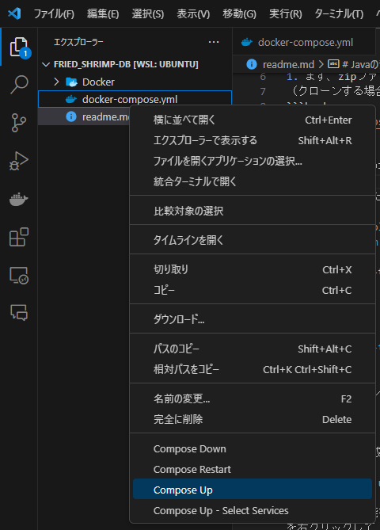

# Javaのデータベース環境

## 使い方
### 前提条件として、Dockerがインストールされているものとします。

1. まず、zipファイルをダウンロードするか、githubからクローンする。
（クローンする場合は以下のコマンドでクローンできます）
```bash
git clone "https://github.com/Kamechan516/fried_jumbo_prawn-DB.git"
```

2. zipファイルの場合は、解答する。

3. ターミナルまたはVSCodeのターミナルなどで以下のコマンドを実行し、イメージを作成します。<br>
<span style="color: red; ">以下のコマンド実行前に必ずDockerを起動しているか確認してください！！</span>
```bash
docker build --target db-dev -t fried_shrimp:1.0-db ./Docker
```
<br>

```bash
docker build --target pma -t fried_shrimp:1.0-pma ./Docker
```

※上記2つのコマンドは必ず１つの処理が終わったのを確認してから実行してください。

<br>

4. イメージに作成が完了したら、VSCodeの拡張機能または、コマンドでコンテナを立ち上げます。
```bash
docker compose up -d
```
VSCodeの拡張機能を使って立ち上げる場合は、エクスプローラーから、**docker-compose.yml**を右クリックして
**Compose up**をクリックすると立ち上がります。


